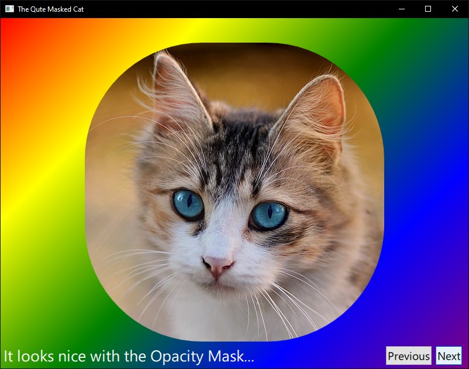

# QML Project with Shaders (Cat Picture with Opacity Mask)

Using shaders in Qt6/QML projects. See the references for more information.

Directory structure. This kind of directory layout makes it easier to find files by type, but makes it more complicated to reference the resources within the project, unless some workarounds are used in the cmake spec file.

~~~
C:.
│   CMakeLists.txt
│   readme.md
│
├───img
│       Tabby_cat_with_blue_eyes.jpg
│
├───qml
│       main.qml
│
├───shaders
│       gaussianblur.frag
│       opacitymask.frag
│
└───src
        main.cpp
~~~

## References

* https://doc.qt.io/qt-6/qtshadertools-build.html
* https://doc.qt.io/qt-6/qml-qtquick-shadereffect.html
* https://doc.qt.io/qt-6/qml-qtquick-shadereffectsource.html
* https://www.qt.io/blog/graphics-in-qt-6.0-qrhi-qt-quick-qt-quick-3d

## Licenses

Except the files below, all others: Copyright (C) 2022, Pedro Lopez-Cabanillas <plcl@users.sourceforge.net>
License: GPLv3 or later

### Opacity Mask Vulkan shader (opacitymask.frag)

Took from the Qt6 qt5compat module: https://github.com/qt/qt5compat/blob/dev/src/imports/graphicaleffects5/shaders_ng/opacitymask.frag
License: GPLv3?

### Gaussian Blur Vulkan shader (gaussianblur.frag)

Qt Blog: https://www.qt.io/blog/in-depth-custom-shader-effects
License: BSD

### Cat picture (Tabby_cat_with_blue_eyes.jpg)

https://commons.wikimedia.org/wiki/File:Tabby_cat_with_blue_eyes-3336579.jpg

License:  Creative Commons CC0 1.0 Universal Public Domain Dedication.

The person who associated a work with this deed has dedicated the work to the public domain by waiving all of their rights to the work worldwide under copyright law, including all related and neighboring rights, to the extent allowed by law. You can copy, modify, distribute and perform the work, even for commercial purposes, all without asking permission. 
